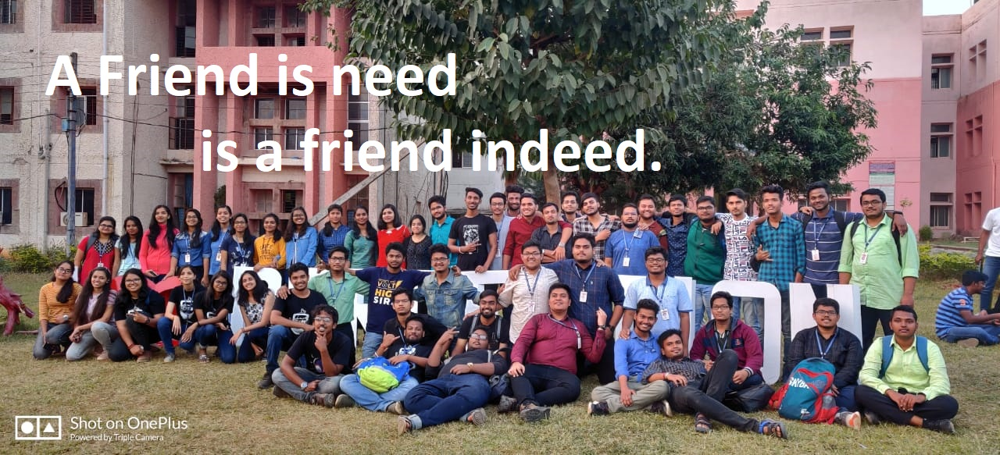
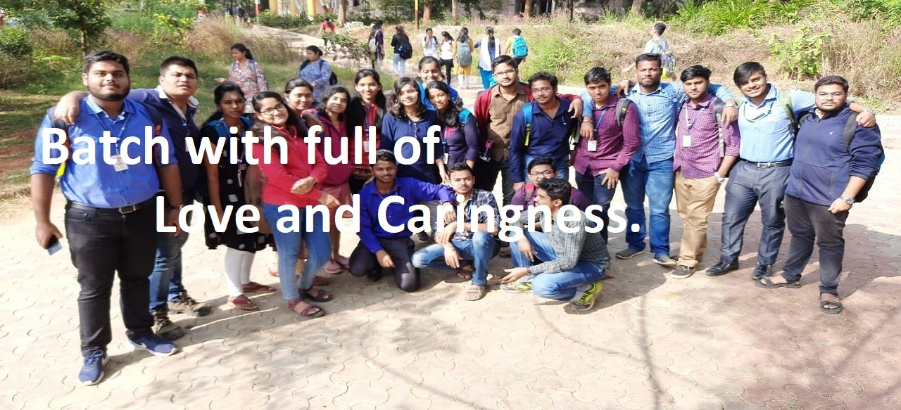
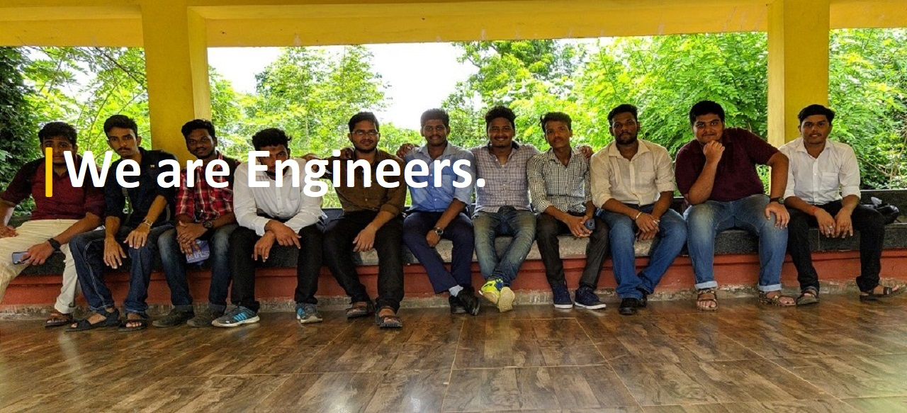
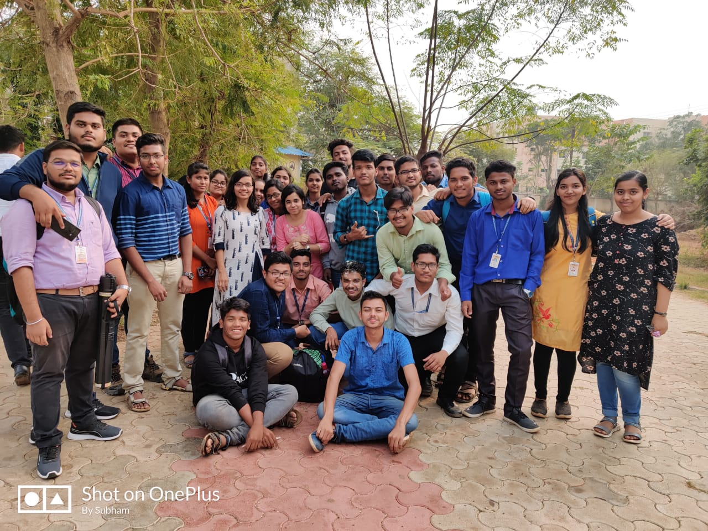
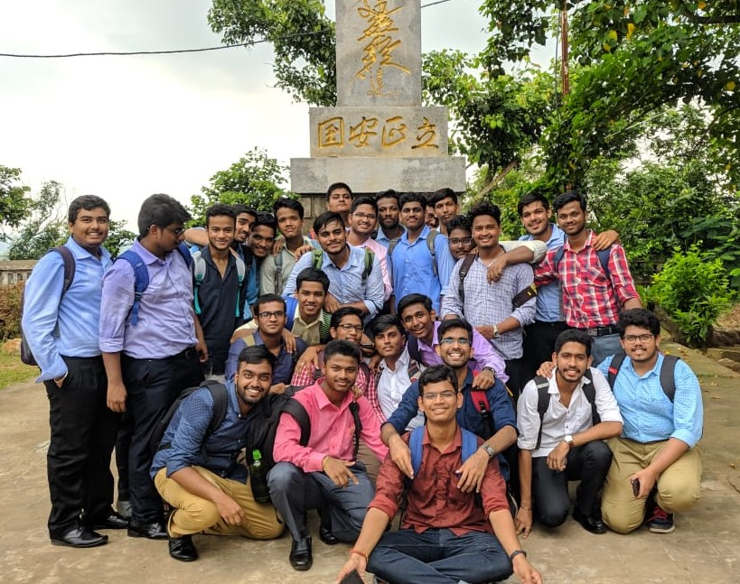
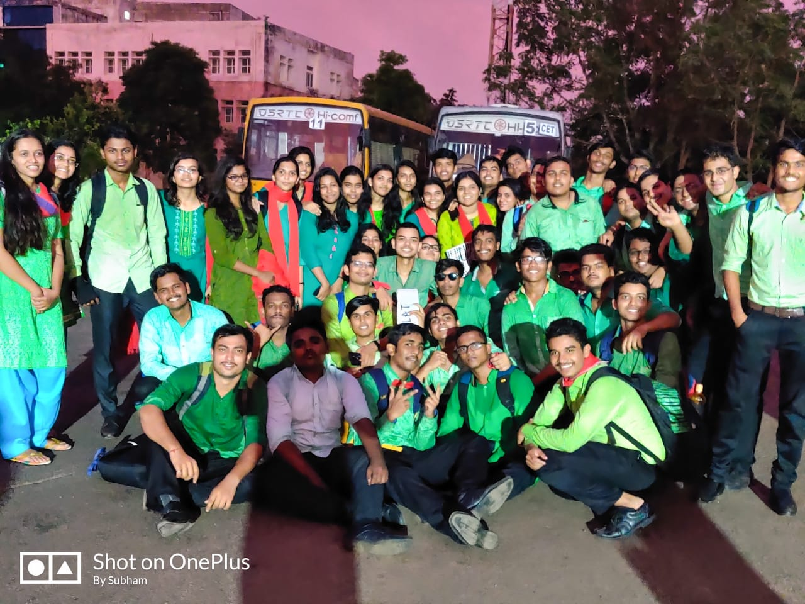
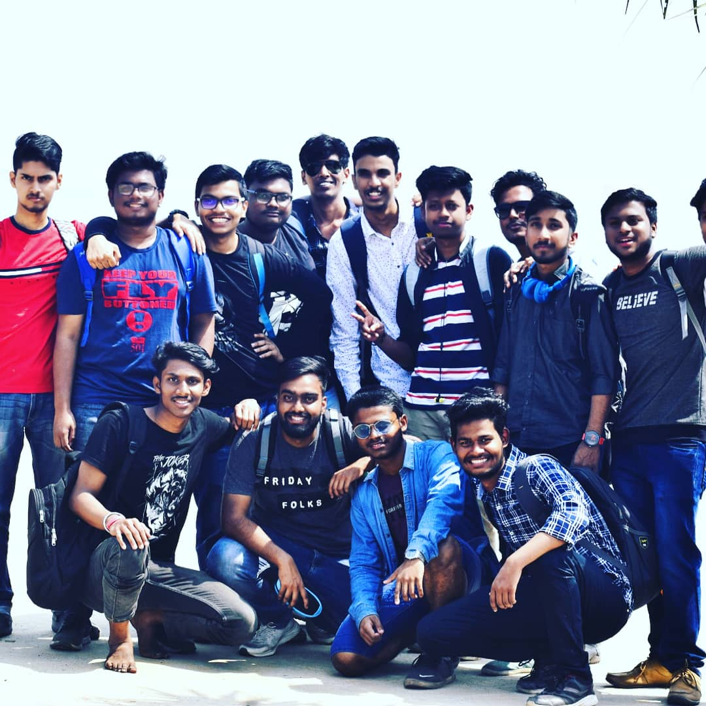
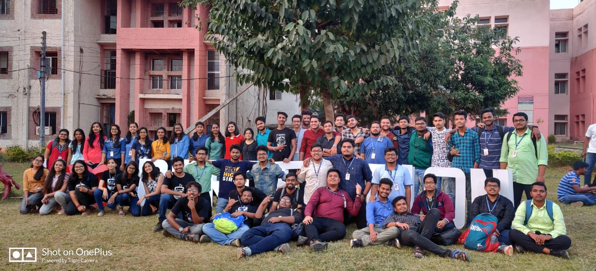

<html lang="en">
  <head>
    <!-- Required meta tags -->
    <meta charset="utf-8">
    <meta name="viewport" content="width=device-width, initial-scale=1, shrink-to-fit=no">
     
    <!-- Bootstrap CSS -->
    <link rel="stylesheet" href="https://stackpath.bootstrapcdn.com/bootstrap/4.5.0/css/bootstrap.min.css" integrity="sha384-9aIt2nRpC12Uk9gS9baDl411NQApFmC26EwAOH8WgZl5MYYxFfc+NcPb1dKGj7Sk" crossorigin="anonymous">
    <link href = "css1.css" rel="stylesheet" />

    <title>Home</title>
    
  </head>
  <body>
    

  

    

      
    

    

      
    

    

      
    

  

  <a class="carousel-control-prev" href="#carouselExampleControls" role="button" data-slide="prev">
    
    Previous
  </a>
  <a class="carousel-control-next" href="#carouselExampleControls" role="button" data-slide="next">
    
    Next
  </a>

<nav class="navbar  sticky-top  navbar-light bg-light">
  <a class="navbar-brand" href="#">IandE United</a>
  <button class="navbar-toggler" type="button" data-toggle="collapse" data-target="#navbarNavDropdown" aria-controls="navbarNavDropdown" aria-expanded="false" aria-label="Toggle navigation">
    
  </button>
  

    <ul class="navbar-nav">
      <li class="nav-item active">
        <a class="nav-link" href="index.html">Home (current)</a>
      </li>
      <li class="nav-item">
        <a class="nav-link" href="html2.html">Memories</a>
      </li>
      <li class="nav-item dropdown">
        <a class="nav-link dropdown-toggle" href="#" id="navbarDropdownMenuLink" role="button" data-toggle="dropdown" aria-haspopup="true" aria-expanded="false">
          Popular
        </a>
        

          <a class="dropdown-item" href="html3.html">Talents</a>
          <a class="dropdown-item" href="html4.html">Achivements</a>
          <a class="dropdown-item" href="html5.html">Academics</a>
        

      </li>
      <li class="nav-item">
        <a class="nav-link" href="html6.html">Students</a>
      </li>
    </ul>
  

</nav> 

  <ul class="list-group list-group-flush">
      <li class="list-group-item"><h3>Welcome</h3></li>
 </ul> 
   

Some memorable days that students will never forget

<!-- Portfolio Gallery Grid -->

   

    

      
      <h3>Our Batch</h3>
      
It may not be the best branch,not have high placement,but one thing you will find is true friendship.From occupying the whole canteen
      to celebrate everyone's birthday like a family..Its I&E here most of the students that joined in this batch cover mostly all region of Odisha and even from some other   
        state.We hopefully abide by the "Unity in Diversity" rule.Students are not just cooperative but also talented.Family in other term is I&E.
      "I&E is not just am  emotion we play together,we laugh together,we live together." 

    

  

  

    

      
      <h3>Induction</h3>
      
Just soon we got enrolled in our college ,the first 21 days were arranged under the college authorities for us to get acquanted with the college atmosphere .As the transition phase from school days to college days is a difficult thing for any student, the college staffs and senior made our journey easy by interacting with us and showing us the college clubs.Various things happened within this 21 days .As students were outside Bhubanswar,so we are also introduced to various tourist and usefull place in Bhubanswar such like Dhauligiri,Barunei and Nandankanan.We just not got familiar with the place but also made friends with each other.It was a memorable journey for all of us as we get such a platform to present each of us infront of senior and batchmate.

    

  

  

    

      
      <h3>Freshers</h3>
      
The first ever recreational moment after our entry in CET. Ohh,you think any one would have dare to miss it? It went 
         totally with the theme-"ALOHA NOVATO" which is a Hawaiian proverb meaning "Freshely Updated".Yep,it was held of a updated kind of event with so magnanimous decoration and surreal ambiencein the conference hall.Better,don't ask about the uniform. It was no less cassata ice-cream.Beside all contrast such as region,rank,and rest other, we found our soulmates that day.Not just we fell prey to those pranks of seniors but also,we met each other, fake proposed each other (some got real sh*t) and danced and enjoyed a lot.  

    

  

  

    

      
      <h3>Picnic</h3>
      
Picnic: (Trip to Chandrabhaga) The first ever branch in whole CET that went to picnic to such a far away place and that too in first year with its own management.All credits to every student who showed eager and interest in successful execution of the idea.It was realy a fantastic trip with a bunch of sweet unforgettable memories that will always remain in everyone's mind.Dj Dance near the beach, Tasty breakfast and lunch,Group games it was really a remarkable day.   

    

  

  

    

      
      <h3>Perception</h3>
      
Perception:The one and only TECH-FEST of CET where various technological competition are held among various technical colleges.Various entertaining and musical events were held like Beg Borrow Steal,Lead The Beast,Open Mic and other tech event.Our department I&E also had a major role in peaceful and proper conduction of the fest.Our seniors were the major coordination manager .Many first year also took part in the competition and bagged various prizes.Its Dj night was really a memorable one for our branch.

    

  

  

    

      
      <h3>Xtasy</h3>
      
Xtasy:The End of an Era..The most awaited popular cultural fest among all the colleges in Odisha.There was an awesome atmosphere of the college for 3 days where many celebrities like Gajendra Verma ,DJ Nikhil,Kevin Zombie Joseph attend the fest to entertain all students.Various entertaining events and competition like Bike stunts,Rodies,BurnOut,OpenMic, were held.I&E seniors also helped a lot for this fest .We all had the greatest 3 days of our lives. 

    

  

  <h5>IandE United (2019-2023)</h5>
  <h6>Content- Subham Nayak</h6>
  <h6>Design & Devloped by- Animesh Samal</h6>
  <h6>Contact for Website - 7978369574</h6>
  <h6>e-mail id-animeshsamal1995@gmail.com</h6>  

<!-- END MAIN -->

  
    <!-- Optional JavaScript -->
    <!-- jQuery first, then Popper.js, then Bootstrap JS -->
    
    
    
  </body>
 </html>
